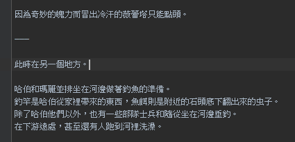
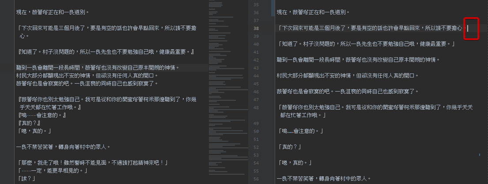
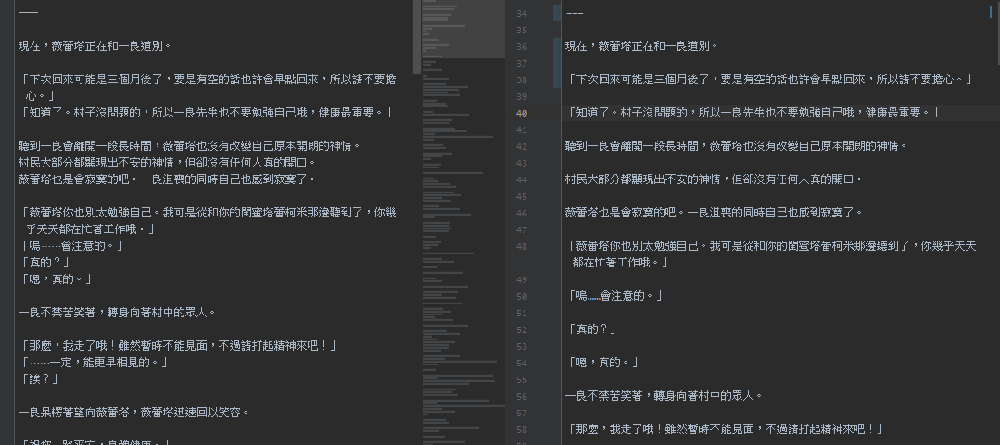
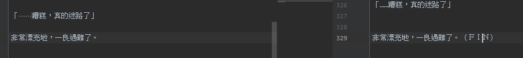

# README

> 使用排版修正時 推薦保留原始檔案 方便做修正

## 常見需要修正的段落類型

### 段落

> 段落相關 另外放置於 [這裡](段落/README.md)

### 分隔線

1. 大段落之間 推薦加上 `---` 或者 符合原文風格的 分隔線
2. 視點切換 場景切換


=>



開頭或結尾的作者雜言 則用 `===============`

---

有時則會在一些類似這種或者狀態表的前後加上 分隔線


### 對話符號

> 對話符號一旦錯誤影響的不只是目前行與下一行 甚至會影響後續的對話符號都發生錯誤

```
“原來如此，確實是這樣的話，“快去死的話就好了’這樣的話也會想要罵的啊”
“對吧？之前也隨意摸過我的身體幾次了，真噁心。……啊，想想都讓我生氣了！”
```

=>

```
「原來如此，確實是這樣的話，『快去死的話就好了』這樣的話也會想要罵的啊』
『對吧？之前也隨意摸過我的身體幾次了，真噁心。⋯⋯啊，想想都讓我生氣了！』
```

這種時候 如果原始檔案仍然在的情況下  
就能簡單的去修正 不然就會導致需要手動修正一堆對話符號  
而如果內文裡面原本就有 `「『` 混雜的話 修正起來會更累人

```
“原來如此，確實是這樣的話，“快去死的話就好了”這樣的話也會想要罵的啊”
```

---



=>



### 多餘內容

> 以下內容大多都是 沒有必要保留的



## 其他

- https://github.com/bluelovers/gm-user-scripts/blob/master/readme/novel-plus-sc.md 其他狀況可以參考此連結內的圖片(但效果並不會相同 因為那是舊版簡易型)
- 
