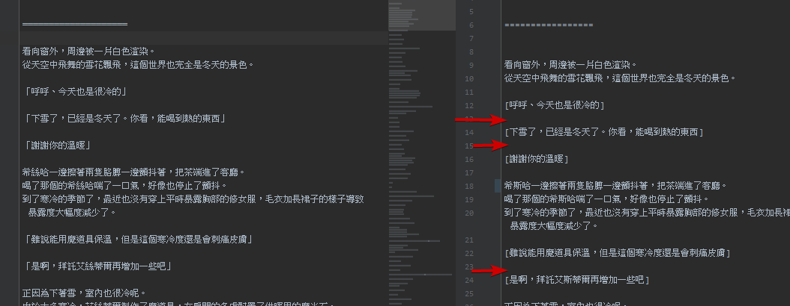
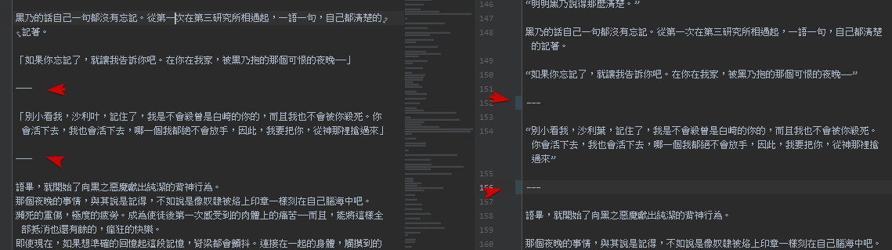
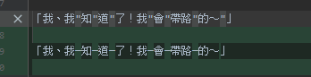

# 手動整理

以下是整理時盡量能做到的部分，如果覺得疲累造成負擔可以在提交記錄內備註需要處理的部分，也許會有其他人幫忙處理

- 一部分作法請參考 [段落](段落/README.md)

## 不該有的斷行或空格

- 有些搬運或翻譯或者甚至是張貼的網站系統問題，導致本來是一行的被強制斷行，這種請在整理時，優先處理

## 段落區隔

- 一部分作法請參考 [分隔線](README.md#分隔線)

由於腳本設計上問題 如果作者或者翻譯者是以 `點` 作為段落區隔的  
請將 `點` 換成 其他符號 例如 `分隔線` 或 ◆ 之類

另外部分翻譯會喜歡在分隔線中間放字 這部分也盡量去除

---

另外 由於設計上問題 在某些狀況下段落間隔用的空行會在整理時 被強制取代掉

1. 例如段落開頭如果是 對話 會導致在整理時 無法區分是否為段落開頭
2. 文章中太多空白行

所以基本上請盡量加上 分隔線或者分隔符號

---

> 整理時 如果無法在經由腳本處理後 讓對話之間的空行消失 請盡量手動刪減空行 或 修正造成處理失敗的地方

---

> 像這類 或者 朗誦信件 故事 之類 也推薦前後加上分隔線

---

如果不是打算依賴腳本處理  
請盡量 讓 對話與非對話之間 有空行存在

## 對話符號

- 一部分作法請參考 [對話符號](README.md#對話符號)

這是最常見也很麻煩的一部分  
由於很多翻譯會用一些奇奇怪怪符號 或者 經常缺漏 開頭或結尾的符號  
導致對話符號無法被正確處理  
所以基本上可以的話 請盡量修正

## 其他符號

常見的錯誤符號(以下請自動腦補 類似字 或者 全形半形)

> 這類錯字有些會因為系統與字體問題導致肉眼看不出差異 但只要換了閱讀器就會發現錯誤以及不美觀

1. 把 中文的 `一` 或者 日文 的 `線` 當成了 `線` 使用
2. 把 `-` 當成了 中文的 `一`

---

- 盡量刪除防和諧用的符號(如果有些符號 可能會錯誤取代 則放棄 或者 等有空再手工取代 盡量只對**絕對不會**發生錯誤的部分來進行批量取代)

## 多餘文字

- 無意義的科普(例如 明明是在科普 但卻是一些超級簡單的基本知識 沒有說明的必要)
- 不有趣的吐槽 劇透
- 沒有必要的註解對話是誰說的
- 章節標題被放置於內文內
- 其他沒必要的內容

## 無法處理並且會發生錯誤的符號

以下符號 由於符合轉換為對話符號的規則  
所以會在處理後發生錯誤  
遇到此類狀況請替換成其他符號或者放棄符號

