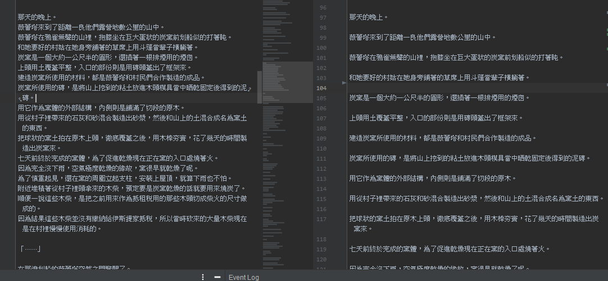

# README

    段落調整相關 推薦 手動微調 搭配 自動整理

以下包含個人喜好所以適度參考即可

基本上會參考原文段落(如果有開著對照的時候)

但如果原文段落閱讀起來容易疲勞或不美觀 則還是會稍作調整

---

=>

---

> 在內文許可的情況下 大段落開頭或者內文開頭 會偏好在開頭一兩行之後 增加一個空行

=>

---

在符合一定條件下

> 段落間多餘的空行可以被自動縮減

---

> 但有些狀況下需要額外手動微調

=>

---

像這種狀況則是因為 雖然其他都是 多了一個空行 但因為紅框部分的行是連在一起的 導致 段落修正 功能 沒有執行

=> 這種時候也需要去手動修正

---

字太多的時候也會增加空行 來避免視覺上疲累

---

當空行過多的時候 會變成強制縮減模式 這種時候 即使追加額外 空白行 也無法按照預期的在處理後增加空行

> 遇到這種狀況 如果有排版需求的話 可以 減少一下 空行數 或者 將多餘空行都拿掉

